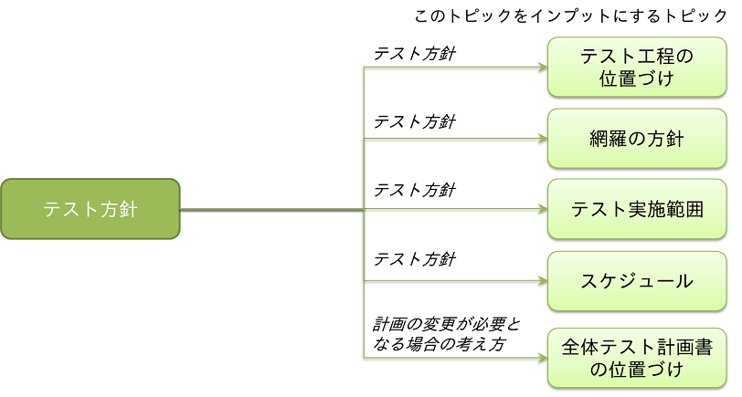

[**« 前の章へ**](./4.md) | [**次の章へ »**](./4-2.md)

## 4.1.テスト方針
このトピックでは、テストに関わる要件、制約を踏まえて、テスト全体に関わる方針を検討します。  
検討においては、テストを効率的に進めるために、プロジェクト全体に課せられた制約や他の工程とのコスト、スケジュールのバランスなど、テスト工程内に閉じない事情を考慮します。  
このテスト方針をベースにして『[4.2.テスト工程の位置づけ](./4-2.md)』や『[4.8.スケジュール](./4-8.md)』などの詳細内容を検討します。  

テスト全体の方針のうち、テストでどのくらい網羅的な検証を行うかについては検討を開始するタイミングが異なるため、『[4.3.網羅の方針](./4-3.md)』に切り出して記載しています。 

### 検討内容の概要
テスト工程全体の方針を定義します。  
実現可能な内容になるよう、留意してください。

#### 全体テスト計画で検討する他のトピックとの関係
このトピックと関係がある主要なトピックは、以下の通りです。
  

### 検討方法

#### 概要
* １. テスト工程に関わる初期条件（要件、制約事項）の収集・整理
* ２. 品質・コスト・スケジュール・テスト実施範囲に関する方針の定義
* ３. その他の方針の定義
* ４. 前提事項の整理

#### 詳細

##### １．テスト工程に関わる初期条件（要件、制約事項）の収集・整理
プロジェクト計画書や要件定義書などをインプットに、テスト工程に関わる要件・制約事項を初期条件として収集・整理します。  

* テスト工程全体で満たすことが求められる品質要件  
* テスト工程全体に対して割り当てられたコスト情報
* テスト工程全体に割り当てられた期間情報（開始日、終了日）
* テスト実施範囲に関わる情報（原則、開発範囲全て）
* プロジェクトが遵守しなければならない制約条件  
※検討要素例については、参考事項を参照してください。
* 重要度（優先度）に関わる情報  
例えば、品質・コスト・スケジュールのうち何を重視しているか、品質の中でも何を重視しているか、など

ただし、この段階での初期条件は、テスト方針を検討する上での初期条件であることに注意してください。  
テスト方針を検討する中で、初期条件の変更をステークホルダーと協議する可能性があります。

##### ２．品質・コスト・スケジュール・テスト実施範囲に関する方針の定義  
品質・コスト・スケジュール・テスト実施範囲に関する方針を検討します。  
これらの４つの要素はお互いにトレードオフの関係にあるため、同タイミングで検討し、辻褄のあう方針を立てる必要があります。  
（例：テスト実施範囲を拡大すると、コストがかかり、テスト期間も必要になる。）  
以下のような流れを参考に検討します。

* １. コスト・スケジュールを試算する。  
初期条件のうち、品質・テスト実施範囲を実現するために必要なコスト・スケジュールを試算します。

   * 品質
     * 初期条件の品質要件を保証するために実施するテスト種別を選択します。 
     * テスト種別の選択は、参考文献『テスト種別カタログ』に挙げられたテスト種別をテーラリングすることで行います。  
     参考文献『テスト種別＆観点カタログ』に同梱のガイドと『[4.2.テスト工程の位置づけ](./4-2.md)』も参照してください。  

   * テスト実施範囲
     * 初期条件のテスト実施範囲に関わる情報の通りとします。  
     具体的な内容は、後ほど、『[4.4.テスト実施範囲](./4-4.md)』で検討します。

   * コスト
     * 初期条件の品質要件とテスト実施範囲に関わる情報から概算コストを試算します。
     * 以下のような条件に当てはまる場合は、上記の概算コストと併せて考慮が必要になることがあります。
         * テストデータの量が多い、作成の難易度が高い
         * テスト環境の構築の難易度が高い
         * エビデンスなど、納品が必要な成果物の量、種類が多い
         * 分析対象の品質指標など、テスト結果報告の詳細度合が高い
         * 保守開発の場合、既存の成果物の品質が悪い
         * 保守開発の場合、影響範囲が大きい
         * テスト対象や作業に対する、担当者の習熟度が低い
         * テスト対象や自動化ツールの使い方などについて、作業前に学習が必要

   * スケジュール
     * 初期条件の品質要件とテスト実施範囲に関わる情報、および概算コストから概算スケジュールを試算します。
     * 概算スケジュールを試算する際には、各テスト種別の実施順番、並行・同時実施の可否なども考慮します。

* ２. 実現可能性の検討とギャップの調整  
試算したコスト・スケジュールを元に、実現可能性を検証します。  
初期条件と試算したコスト・スケジュールにギャップがある場合は、そのギャップを調整します。

   * 実現可能性の検証
     * 非現実的な計画ではないか？
     * リスクを考慮してコストやスケジュールのバッファを確保しているか？
     * ステークホルダーの合意が得られる計画か？

   * ギャップの調整
     * １. テスト工程全体のコスト・スケジュールの調整  
    例えば、以下のような要素を調整します。  
        * テストエビデンスの削減
        * ステークホルダーによるテスト実施
        * テスト実施順序の変更
        * テストの並列実施
        * テストツールの適用  
        ただし、メンバーのトレーニング工数やツール購入費用により、テストツール適用の結果コスト・スケジュールが増えることもあるので注意。 
        * 業務知識を保有したメンバーのアサイン
        * テストデータの再利用
     * ２. プロジェクト全体のコストやスケジュールの調整  
     例えば、以下のような要素を調整します。  
        * テスト工程に対するコスト配分変更
        * テスト工程の開始日の前倒し
     * ３. ステークホルダーとの初期条件の変更調整  
     例えば、以下のような要素を調整します。  
        * 実施するテスト種別の削減の調整
        * 予算の追加調整
        * 納期延期や段階リリースの調整  
        * テスト実施範囲の削減の調整

* ３. 品質・コスト・スケジュール・テスト実施範囲に関するテスト方針を定義する。  
これまでの検討結果を元に、テスト方針を定義します。

   * 具体的な方針内容に加え、「テスト方針を立てるに至った経緯・根拠」も明らかにします。  
   ステークホルダーとの認識齟齬のないテスト方針の合意のために必要となります。
   * ビジネス目的・目標との整合性も確認します。  
   プロジェクト活動は、ビジネス目的・目標達成のために行っているものであり、テストも同様です。  
   よって、ここで定義したテスト方針についても、ビジネス目的・目標と整合している必要があります。 

##### ３. その他の方針の定義
これまで検討してきた方針の他に定義が必要な方針を、プロジェクト特性などを加味して検討します。  
※検討例については、参考事項を参照してください。

##### ４. 前提事項の整理
これまで検討してきた方針を成立させるための前提条件を、整理します。

*  前提条件と、前提条件が変更された場合は全体テスト計画を変更する旨を明らかにします。
    * 全体テスト計画書（ドキュメント）上は、『[5.1.全体テスト計画書の位置づけ](./5-1.md)』で検討する、全体テスト計画書の変更時の承認フローとあわせて記載します。
*  前提条件の例
   * YYYY年MM月までに仕様凍結していること。
   * YYYY年MM月からYYYY年MM月まで、○○環境を占有できること。 

### 参考事項
* 「制約条件」の検討要素を参考として例示します。  
  * Who（誰が）  
    * 体制・役割
  * What（何を）  
    * テスト環境  
    * テストデータ  
    * テスト実施範囲  
  * When（いつ）  
    * テスト期間  
  * Where（どこで）  
    * テスト実行場所  
  * How（どのように）
    * テストデータ準備やテスト実行の手段  

* 「その他の方針」の検討例を参考として示します。  
ただし、これらはプロジェクト計画書やプロジェクト運営手順書などで明記されていることが多いため、その内容を確認してください。
  * 品質指標  
    * 例：○○の品質指標を収集し、今後のプロセス改善に繋げる。
  * 成果物  
    * 例：社内標準の書式を適用することで、ドキュメント作成の作業効率を上げる。
  * セキュリティ
    * 例：本番データ取扱いに関する方針（マスキング対象、管理方法、使用後のデータ取扱い方法など）

[**« 前の章へ**](./4.md) | [**次の章へ »**](./4-2.md)
