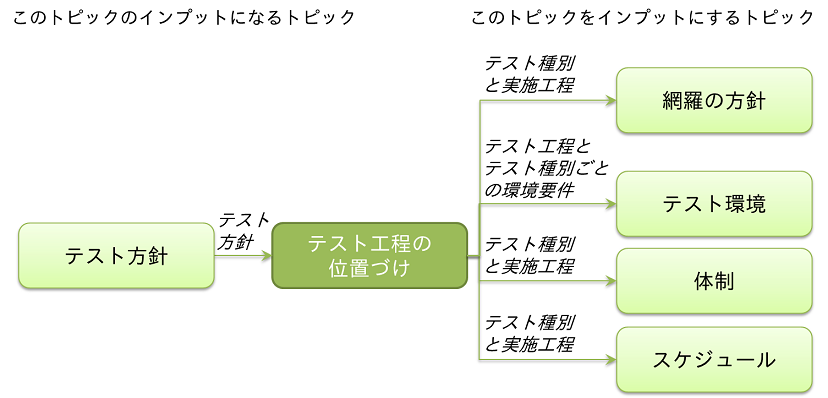

[**« 前の章へ**](./4-1.md) | [**次の章へ »**](./4-3.md)

## 4.2.テスト工程の位置づけ
このトピックでは、いつ（どの工程で）、どのようなテスト種別のテストを行うのか、実施に必要なデータや環境要件は何か、という事について検討します。  
これらの事項は、品質目標の達成状況の確認や、テスト工程やプロジェクト全体のQCDに影響するため、プロジェクトの早期段階で検討すべきです。  
この章で確認した要件を元に、テスト環境の要件や遷移、テストスケジュールなどをより具体的に検討することになります。

### 検討内容の概要
各テスト工程でどのようなテストを行うかを定義し、テスト全体で検証する内容とテスト同士の前後関係を見通せるようにします。  
本書では、参考文献『テスト種別＆観点カタログ』の利用を前提とします。  
結合テスト、システムテストといったテストを行う工程は、工程計画として既に明らかになっているものとします。  

各テスト工程でどのテスト種別のテストを行うかを決定し、更にテスト工程とテスト種別の組み合わせごとに以下を明らかにします。

* 範囲
* 目的
* テストデータの要件
* テスト環境
* 先行するテスト種別
    * 機能テストの結果を踏まえて性能テストを行う場合など、同じ工程内でテスト種別同士の間に前後関係がある場合は、わかるようにする必要があります。  
      先に開始や終了をさせる必要があるテスト種別を、明らかにします。

#### 全体テスト計画で検討する他のトピックとの関係
このトピックと関係がある主要なトピックは、以下の通りです。  

### 検討方法

#### 概要
* １. 実施するテスト種別を選定します。
* ２. テストを行う工程を確認します。
* ３. 各テスト種別の範囲を決定し工程に割り当てます。
* ４. テスト種別と工程の組合せごとに、目的とテスト実行に必要な詳細を決定します。
* ５. テスト種別と工程の組合せごとに、テスト環境の要件を明確にします。
* ６. 工程内でのテスト種別同士の前後関係を決定します。

#### 詳細

##### １．実施するテスト種別を選定します。
* 参考文献『テスト種別＆観点カタログ』に含まれている『テスト種別カタログ』より、必要なテスト種別を選定し、その優先度を確認します。  
    * 『テスト種別カタログ』の利用には、プロジェクトの事情にあわせるためのテーラリングが必要です。  
    参考文献『テスト種別＆観点カタログ』に同梱のガイドも参照してください。
* 達成するべき品質や考慮すべき品質特性が、具体的に品質目標として定義されている場合は、それに従います。  
定義がない場合は、例えば以下を考慮します。
    * プロジェクトやシステムの概要、要件。
        * システム化の目的や、プロジェクトの目的。
        * 移行元や比較元になるソフトウェア、システムの有無。
        * 想定ユーザーや、動作保証が必要な環境。
        * 追加や変更が行なわれる予定の箇所。例えば、プログラムの修正がなく設定ファイルの変更のみであることなど。
        * 処理方式（ウェブアプリケーション、バッチアプリケーションなど）。
    * プロダクト・リスク。
    * 類似システムの過去不具合。
    * テスト方針。

##### ２．テストを行う工程を確認します。
* プロジェクト計画書に記載されている工程計画などで確認します。

##### ３. 各テスト種別の範囲を決定し工程に割り当てます。
* どの要素（1機能ずつ、サブシステム間など）に対してテストを行うか決定します。
* 工程への割り当ては、ピックアップした工程の目的や作業概要を見ながら決定します。
    * 問題が起きた時に対応を容易にするために範囲を徐々に広げながら複数の工程で確認する、といったことも検討します。
* 以下について、各テスト工程のタイミングや目的と整合していることを確認します。
    * テスト種別の目的と、テストケース作成などの準備やテストの実行が可能になるタイミング。
        * 参考文献『テスト種別カタログ』の欄『インプット成果物』を参考にするとよいでしょう。  
          欄『インプット成果物』は、テスト種別ごとに検証内容の検討で必要になる要件定義書や設計書を挙げたものです。  
          該当の成果物がないとテストケースを検討できないため、ここに挙げられている成果物の入手可否を確認することで、計画したタイミングのフィジビリティを確認できます。  
           詳しくは、『テスト種別カタログ』が含まれている参考文献『テスト種別＆観点カタログ』をご覧ください。  
    * 優先度。
        * 優先度は、品質目標や品質計画、全体テスト計画で検討したテスト方針を元に検討します。

##### ４. テスト種別と工程の組合せごとに、目的を決定します。
* テストの目的を明らかにします。
    * テスト種別と工程の組合せごとにどのような検証が必要なのかがわかるよう、目的を明らかにします。
        * 目的には、テストで達成したい品質目標や、そのテスト種別が必要な理由を反映します。 

##### ５. テスト種別と工程の組合せごとに、テスト実行に必要な詳細とそれを踏まえたテスト環境の要件を明確にします。
* １. テスト同士や、テストと移行や移行リハーサルとの間に依存関係がある場合は、明らかにします。
    * 例えば、あるテストで作成したデータを別のテストで使うといった場合。
* ２. テスト実行に必要なテストデータの要件を明らかにします。
    * データのバリエーションが本番同等である必要があるかどうか。
    * 件数。
    * 入手手段。旧システムから抽出する、ツール等で作成する、手作成する、など。
        * 本番データや移行データを利用する場合、どのタイミングのデータを利用するかもあわせて確認します。
        * 例えば、準備にあたり本番環境など特定の環境を利用する場合は、テスト環境だけでなくデータ準備のための環境の調整も行う必要があります。
    * マスキングや暗号化の必要有無、データをテスト環境に登録する手段やタイミングといった、データを入手した後の注意点も、あわせて明らかにします。
* ３. テスト実行の手段を確認します。次項の、テスト環境の検討に影響するためです。
    * 自動化の有無。
         * テスト実行を自動化しないと実現困難なテストや、逆に手で実行しないと目的を達成できないテストがないか、確認します。
    * 自動化を行う場合は、必要なツールやその調達。
* ４. 以上の検討結果を踏まえて、テスト環境の要件に影響する次の内容も確認します。
    * 本番環境と同じ条件にする必要がある箇所、本番環境を使う必要がある箇所。
        * 例えば、テストデータやコンピューターのメモリ、接続先のシステムなど。
    * テスト対象の動作、テスト実行、テストの結果確認に必要なツールやミドルウェア。
        * 例えば、バッチアプリケーションのテストで使うジョブ管理システムや、帳票出力のテストで必要な電子帳票のビューアー。
    * テスト対象の動作、テスト実行、テストの結果確認に必要な環境やネットワーク。
        * 接続先システムとそのシステムに繋げるためのネットワーク、現新比較テストでの現行システムのように期待結果の確認に必要な環境。
    * セキュリティ面の制約。
        * 特定のエリア外に持ち出せないデータや特定のエリア内でしかアクセスできない環境がテストで必要かどうか。
    * テスト環境にアクセスする人、作業場所。

##### ６. 工程内でのテスト種別同士の前後関係を決定します。
* 優先度、テストデータの入出力関係などを元に、先に実施するテスト種別を明らかにします。
* 以下を踏まえて決定します。
    * ステークホルダーから強く要望されている品質目標を満たすために必要な、優先度の高いテスト種別はどれか。
    * 他のテスト種別の前提となるテスト種別や、テスト実行により他のテスト種別で利用できるテストデータを生成するテスト種別はどれか。
        * 例えば、機能テストを一通り実施して動作することを確認してから性能テストを実施する場合や、機能テストの実行により作成されるテストデータを元に業務シナリオテストを行う場合は、機能テストを早期に完了させる必要があります。

### 参考事項
* 工程計画が整備されていても、このトピックを検討する中で工程を見直した方がよい場合があるかもしれません。  
必要なテストの管理や作業実施する上で、工程計画通りの工程の分け方や定義のままでは効率的なテストが行えないと判断した場合は、工程の分割を検討するなど、見直しを勧めます。
* 特に検証したい内容がある場合は、テスト種別よりさらに具体的なテスト観点について、全体テスト計画の段階から明らかにしておくとよいでしょう。
    * テスト観点を検討する場合は、参考文献『テスト種別＆観点カタログ』に含まれる『テスト観点カタログ』を参照してください。

[**« 前の章へ**](./4-1.md) | [**次の章へ »**](./4-3.md)
