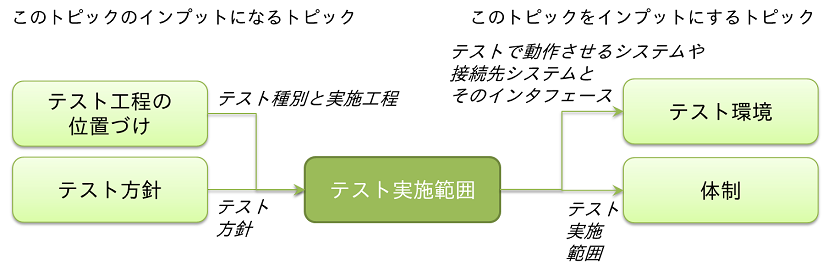

[**« 前の章へ**](./4-3.md) | [**次の章へ »**](./4-5.md)

## 4.4.テスト実施範囲
このトピックでは、テストを行う範囲についてステークホルダー間で事前に認識をあわせるため、誰が、どこのテストについて責任を持つのか、検討します。  
  
テスト対象のシステムが外部システムと連携している場合や、あるシステムの一部だけを改修するプロジェクトの場合、人によって想定するテスト実施範囲が異なることがあります。  
認識齟齬を解消しないままテストを進めてしまうと、作業途中で以下のような問題が発生し、プロジェクトのQCD目標を守れなくなる可能性があります。

* 想定するテスト実施範囲が異なっていたことで、テストケース作成後やテスト実行後にステークホルダーから十分なテストができていないと判断され、計画外のテストを追加で実施することになった。

### 検討内容の概要
テスト対象とする機能やインタフェース、対象外とする機能やインタフェースを明確にして、テスト全体の範囲を確認します。  
検討前に、要件定義書などで自プロジェクトのプログラミングや設定をする範囲（開発範囲）を確認しておく必要があります。  

#### 全体テスト計画で検討する他のトピックとの関係
このトピックと関係がある主要なトピックは、以下の通りです。  

### 検討方法
* １. 開発範囲に含まれる機能、インタフェースなどを洗い出し、テスト実施範囲に含まれるかどうか切り分けます。これらはほとんどの場合、すべてテスト実施範囲内となります。
* ２. 開発範囲外についても、テスト実施範囲とすべき部分がないか検討します。
    * 外部ベンダーの製品やOSSを組み込む場合、開発範囲から直接利用する部分のみなど限定的にテスト実施範囲に含めることがあります。
    * 保守、保守開発における母体の部分など、開発範囲でなくても開発範囲から影響を受ける恐れがある部分は、原則テスト実施範囲に含めます。 
* ３. ここまでで洗い出された機能、インタフェースなどについて、テスト実施範囲外とする部分がある場合はその理由とあわせて、明らかにします。  
    * 開発範囲から影響を受ける恐れがあるものの、コストや品質目標などを加味してテストを割愛する場合が考えられます。
* ４. テスト実施範囲と範囲外を書き出し、RFP、提案書、要件定義書など、開発範囲について触れている成果物や決定事項と矛盾がないか確認してください。  
* ５. 境界がわかりやすくなるように、整理した範囲と範囲外、その境界を、図で表現します。  
    * 他システム連携がある場合や母体となるシステムがある場合など、開発範囲とやりとりする要素が複数ある場合に、境界を明確にするためです。
    * システム間連携がない小規模のツールの開発でテスト実施範囲が判りやすい場合など、図が不要なこともあります。  
    この場合でも、テスト実施範囲の機能をリストにするなどして、必ずテスト実施範囲についてステークホルダーと認識をあわせてください。

#### テスト実施範囲と範囲外を切り分ける場合の考慮点
以下を考慮して切り分けます。

* 開発範囲
* 開発範囲と連携する他のプログラムやシステム
* 開発範囲のプログラムから利用しているライブラリやツール
* パッケージカスタマイズ案件の場合は、母体となるパッケージのうち、開発範囲の動作に必要な部分および影響を受ける恐れがある部分
* 保守、保守開発の場合は、母体となるシステムのうち、開発範囲の動作に必要な部分および影響を受ける恐れがある部分

### 参考事項
* プロジェクトチーム以外がテストを行う部分がある場合は、プロジェクトチーム以外のテスト実施範囲もあわせて明らかにして、ステークホルダーと認識をあわせてください。
    * お互いに相手がテストすると勘違いした結果、誰もテストしない状態を避けるため。
* 開発開始後に、仕様変更で開発対象機能が追加されるなど、開発範囲に影響する変更があった場合、テスト実施範囲もあわせて見直してください。
* 同一プロジェクト内で段階リリースを行いテスト工程も分離する場合は、リリースの単位でテスト実施範囲を明確にしてください。

[**« 前の章へ**](./4-3.md) | [**次の章へ »**](./4-5.md)
