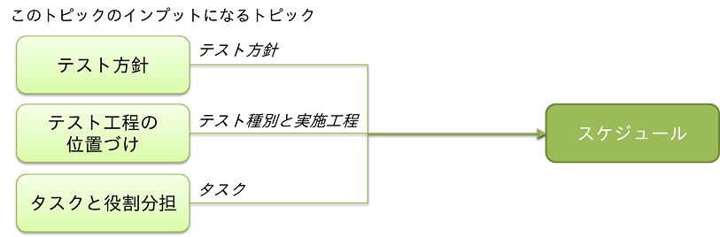

[**« 前の章へ**](./4-7.md) | [**次の章へ »**](./4-9.md)

## 4.8.スケジュール
各テストをいつ、どのくらいの期間行うかを可視化するためのトピックです。  
スケジュール上の制約や主要マイルストーンもあわせて明らかにし、それらがテストに及ぼす影響がわかるようにします。  
プロジェクト計画で検討済みの場合は、全体テスト計画の他トピックにおける検討内容との整合性を確認します。

### 検討内容の概要
それぞれのテスト工程やテスト種別をいつ実施するのか、を明らかにします。

#### 全体テスト計画で検討する他のトピックとの関係
このトピックと関係がある主要なトピックは、以下の通りです。   

### 検討方法
テスト工程やテスト種別同士の前後関係を俯瞰できるよう、以下を確認します。  
プロジェクト計画書など全体テスト計画書以外の成果物に記載されることもありますが、その場合も以下を確認します。  

* プロジェクト全体のスケジュールや予定しているタスクと矛盾していない。
    * 例えば、1ヵ月以上かかるタスクがあるテスト工程の期間が、1ヵ月以上確保されていること。
* 各テスト工程、テスト種別の実施期間が明らかである。
    * 複数サイクルに分けてテストを実施する場合は、サイクルの開始と終了も分かるようにします。
* 各テスト工程同士、テスト種別同士、関係する工程やアクティビティとの前後関係が明らかである。
    * テスト工程以外のアクティビティで生成されたデータをテストデータにする場合、それらのアクティビティとの前後関係がわかるようにします。  
     移行準備で作成した本番移行予定データをテストデータにする場合などが、該当します。
* 各テスト工程、テスト種別の実施に関わる主要マイルストーンが明らかである。
    * テスト環境構築の完了予定日やテストデータの入替タイミング、本番リリース予定日など

[**« 前の章へ**](./4-7.md) | [**次の章へ »**](./4-9.md)
