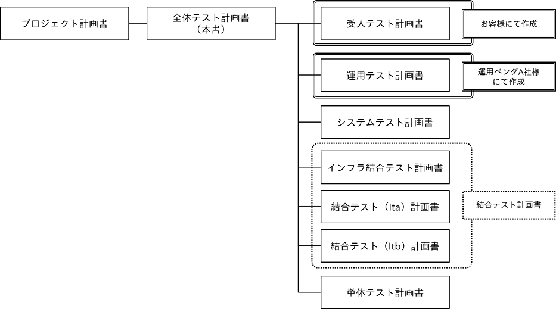

[**« 前の章へ**](./4-9.md)

## 5.1.全体テスト計画書の位置づけ
このトピックは、全体テスト計画をドキュメント「全体テスト計画書」に落とし込む際に必要になります。  
他のドキュメントとの関係を明らかにし、このドキュメントの役割やスコープを示すためのトピックです。

### 検討内容の概要
全体テスト計画の検討結果をまとめたドキュメント「全体テスト計画書」の位置づけを明確にします。

#### 全体テスト計画で検討する他のトピックとの関係
このトピックと関係がある主要なトピックは、以下の通りです。  

### 検討方法
* １. 「全体テスト計画書」のドキュメントとしての位置づけを確認します。   
  * １. プロジェクト計画として整理されているドキュメントの一覧を確認します。   
全体テスト計画書について、以下が考慮されていることを確認します。
     * 納品するかどうか
       * 納品対象でない場合は、プロジェクトの状況（習熟度や予算など）に合わせて記載粒度を検討します。
     * 作成や承認を担当するのは誰か
     * いつから作成を開始するか
  * ２. 全体テスト計画書に関連するドキュメントについて、以下を確認します。  
確認後に、ドキュメント間の関連を図にまとめることを推奨します。
     * 全体テスト計画書のインプットとなる上位文書
     * 全体テスト計画書の記載を元に作成する下位文書
     * 各ドキュメントについて、納品するかどうか
     * 各ドキュメントについて、作成や承認を担当するのは誰か
     * 各ドキュメントについて、いつから作成を開始するか
     * 図の例  

* ２. 全体テスト計画書に記載する範囲を決めます。  
自プロジェクトが担当するテスト実施範囲全体について、全体テスト計画書に記載します。   
外部システムとの接続や、ユーザー部門が実施するテストがある場合、全体テスト計画書に含める必要があるか明確にします。
* ３. 全体テスト計画書の記載を変更するのはどのような場合か、変更時にどのようなフローで再度承認を受けるか、決めておきます。   
なお、計画の変更が必要となる場合の考え方については、『[4.1.テスト方針](./4-1.md)』を参照してください。
* ４. その他、以下の事項を検討します。
    * 全体テスト計画書および関連するドキュメントのセキュリティレベル（公開範囲）
    * 全体テスト計画書および関連するドキュメントの構成管理方法

[**« 前の章へ**](./4-9.md)
